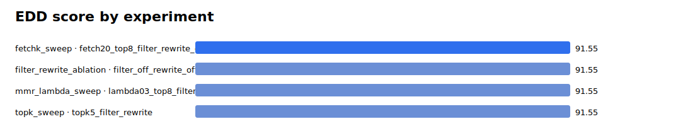

# Parallel Eval Summary

EDD score definition: 20% coverage, 10% hit-all-targets, 15% MRR, 20% groundedness, 20% relevance, 10% abstention accuracy, 5% latency score.

## Best By Suite

| suite | experiment | EDD | coverage | MRR | groundedness | relevance | latency |
|---|---|---:|---:|---:|---:|---:|---:|
| fetchk_sweep | fetch20_top8_filter_rewrite_control | 91.55 | 1.000 | 1.000 | 4.000 | 4.000 | 10.000 |
| filter_rewrite_ablation | filter_off_rewrite_off | 91.55 | 1.000 | 1.000 | 4.000 | 4.000 | 10.000 |
| mmr_lambda_sweep | lambda03_top8_filter_rewrite | 91.55 | 1.000 | 1.000 | 4.000 | 4.000 | 10.000 |
| topk_sweep | topk5_filter_rewrite | 91.55 | 1.000 | 1.000 | 4.000 | 4.000 | 10.000 |

## Top Experiments

| rank | suite | experiment | EDD | coverage | MRR | groundedness | relevance | latency |
|---:|---|---|---:|---:|---:|---:|---:|---:|
| 1 | fetchk_sweep | fetch20_top8_filter_rewrite_control | 91.55 | 1.000 | 1.000 | 4.000 | 4.000 | 10.000 |
| 2 | filter_rewrite_ablation | filter_off_rewrite_off | 91.55 | 1.000 | 1.000 | 4.000 | 4.000 | 10.000 |
| 3 | mmr_lambda_sweep | lambda03_top8_filter_rewrite | 91.55 | 1.000 | 1.000 | 4.000 | 4.000 | 10.000 |
| 4 | topk_sweep | topk5_filter_rewrite | 91.55 | 1.000 | 1.000 | 4.000 | 4.000 | 10.000 |

