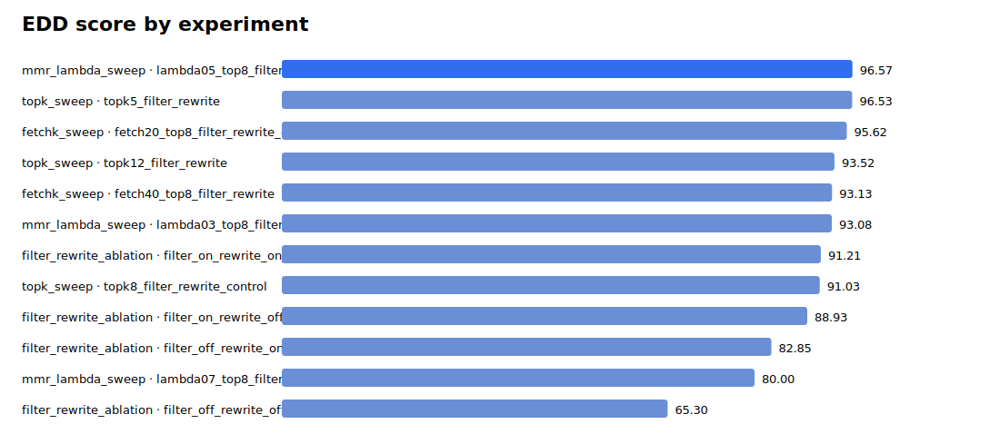
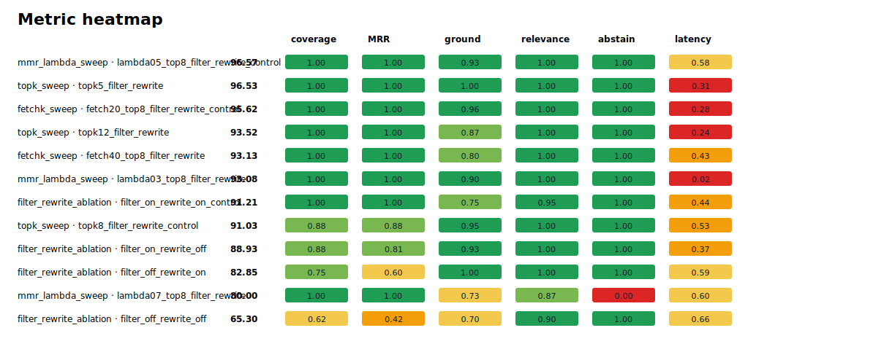
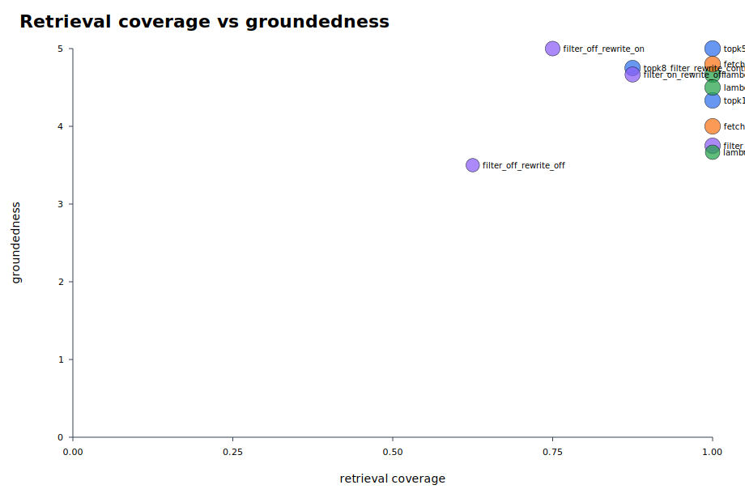
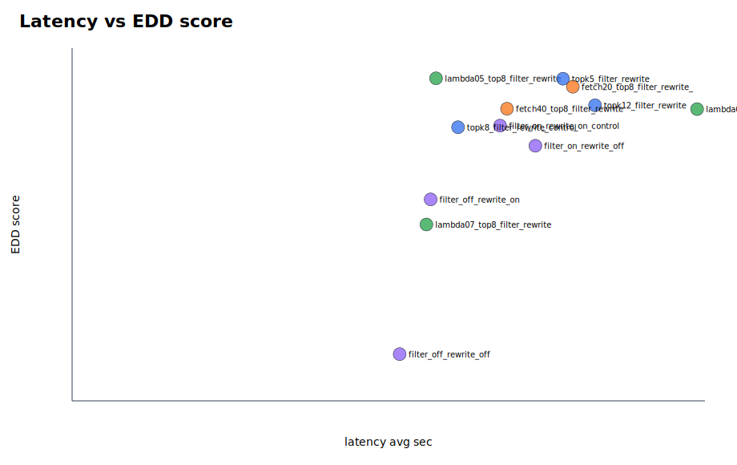

# Parallel Eval Summary

EDD score definition: 20% coverage, 10% hit-all-targets, 15% MRR, 20% groundedness, 20% relevance, 10% abstention accuracy, 5% latency score, minus penalties for false abstention and empty answers.

## Best By Suite

| suite | experiment | EDD | coverage | MRR | groundedness | relevance | false abstain | empty | latency |
|---|---|---:|---:|---:|---:|---:|---:|---:|---:|
| fetchk_sweep | fetch20_top8_filter_rewrite_control | 95.62 | 1.000 | 1.000 | 4.800 | 5.000 | 0.000 | 0.000 | 23.739 |
| filter_rewrite_ablation | filter_on_rewrite_on_control | 91.21 | 1.000 | 1.000 | 3.750 | 4.750 | 0.000 | 0.000 | 20.287 |
| mmr_lambda_sweep | lambda05_top8_filter_rewrite_control | 96.57 | 1.000 | 1.000 | 4.667 | 5.000 | 0.000 | 0.000 | 17.251 |
| topk_sweep | topk5_filter_rewrite | 96.53 | 1.000 | 1.000 | 5.000 | 5.000 | 0.000 | 0.000 | 23.269 |

## Top Experiments

| rank | suite | experiment | EDD | coverage | MRR | groundedness | relevance | false abstain | empty | latency |
|---:|---|---|---:|---:|---:|---:|---:|---:|---:|---:|
| 1 | mmr_lambda_sweep | lambda05_top8_filter_rewrite_control | 96.57 | 1.000 | 1.000 | 4.667 | 5.000 | 0.000 | 0.000 | 17.251 |
| 2 | topk_sweep | topk5_filter_rewrite | 96.53 | 1.000 | 1.000 | 5.000 | 5.000 | 0.000 | 0.000 | 23.269 |
| 3 | fetchk_sweep | fetch20_top8_filter_rewrite_control | 95.62 | 1.000 | 1.000 | 4.800 | 5.000 | 0.000 | 0.000 | 23.739 |
| 4 | topk_sweep | topk12_filter_rewrite | 93.52 | 1.000 | 1.000 | 4.333 | 5.000 | 0.000 | 0.000 | 24.790 |
| 5 | fetchk_sweep | fetch40_top8_filter_rewrite | 93.13 | 1.000 | 1.000 | 4.000 | 5.000 | 0.000 | 0.000 | 20.617 |
| 6 | mmr_lambda_sweep | lambda03_top8_filter_rewrite | 93.08 | 1.000 | 1.000 | 4.500 | 5.000 | 0.000 | 0.000 | 29.628 |
| 7 | filter_rewrite_ablation | filter_on_rewrite_on_control | 91.21 | 1.000 | 1.000 | 3.750 | 4.750 | 0.000 | 0.000 | 20.287 |
| 8 | topk_sweep | topk8_filter_rewrite_control | 91.03 | 0.875 | 0.875 | 4.750 | 5.000 | 0.000 | 0.000 | 18.297 |
| 9 | filter_rewrite_ablation | filter_on_rewrite_off | 88.93 | 0.875 | 0.812 | 4.667 | 5.000 | 0.000 | 0.000 | 21.961 |
| 10 | filter_rewrite_ablation | filter_off_rewrite_on | 82.85 | 0.750 | 0.604 | 5.000 | 5.000 | 0.111 | 0.000 | 16.998 |
| 11 | mmr_lambda_sweep | lambda07_top8_filter_rewrite | 80.00 | 1.000 | 1.000 | 3.667 | 4.333 | 0.000 | 0.000 | 16.796 |
| 12 | filter_rewrite_ablation | filter_off_rewrite_off | 65.30 | 0.625 | 0.417 | 3.500 | 4.500 | 0.333 | 0.000 | 15.526 |

## Visuals

