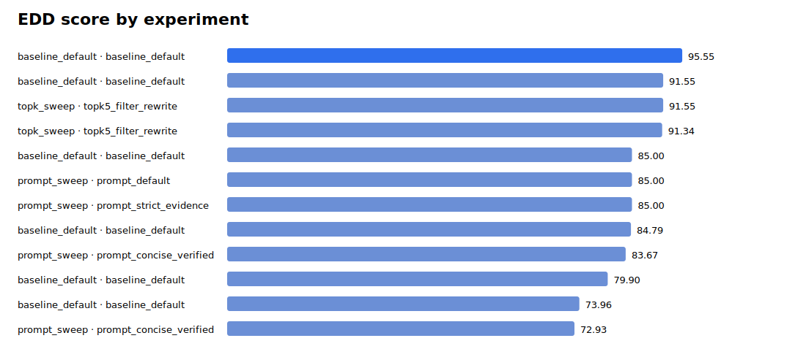
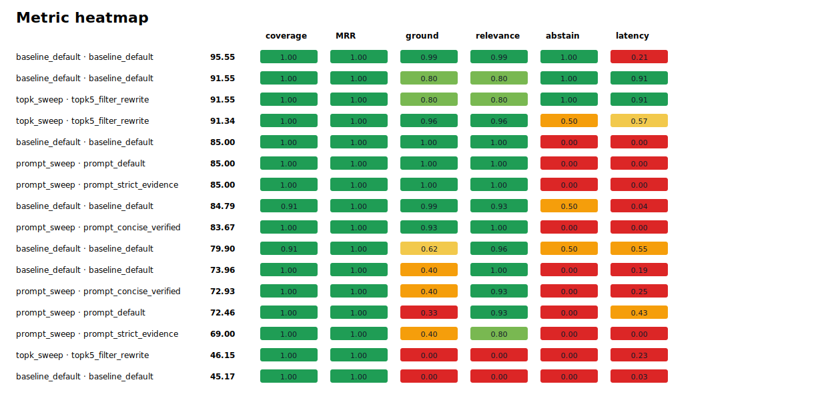
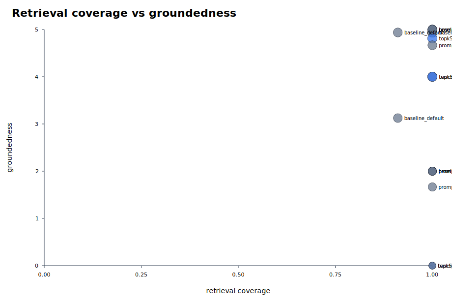
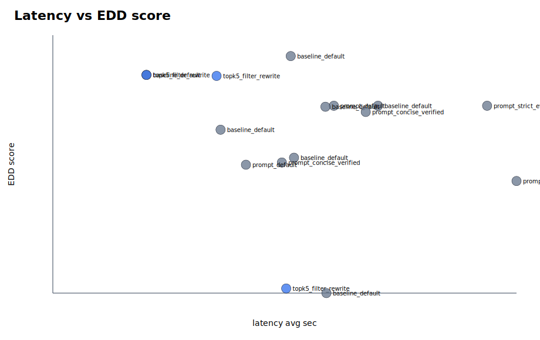

# Parallel Eval Summary

EDD score definition: 20% coverage, 10% hit-all-targets, 15% MRR, 20% groundedness, 20% relevance, 10% abstention accuracy, 5% latency score, minus penalties for false abstention and empty answers.

## Best By Suite

| suite | experiment | EDD | coverage | MRR | groundedness | relevance | false abstain | empty | latency |
|---|---|---:|---:|---:|---:|---:|---:|---:|---:|
| baseline_default | baseline_default | 95.55 | 1.000 | 1.000 | 4.938 | 4.938 | 0.000 | 0.000 | 25.413 |
| prompt_sweep | prompt_default | 85.00 | 1.000 | 1.000 | 5.000 | 5.000 | 0.000 | 0.000 | 30.027 |
| topk_sweep | topk5_filter_rewrite | 91.55 | 1.000 | 1.000 | 4.000 | 4.000 | 0.000 | 0.000 | 10.000 |

## Top Experiments

| rank | suite | experiment | EDD | coverage | MRR | groundedness | relevance | false abstain | empty | latency |
|---:|---|---|---:|---:|---:|---:|---:|---:|---:|---:|
| 1 | baseline_default | baseline_default | 95.55 | 1.000 | 1.000 | 4.938 | 4.938 | 0.000 | 0.000 | 25.413 |
| 2 | baseline_default | baseline_default | 91.55 | 1.000 | 1.000 | 4.000 | 4.000 | 0.000 | 0.000 | 10.000 |
| 3 | topk_sweep | topk5_filter_rewrite | 91.55 | 1.000 | 1.000 | 4.000 | 4.000 | 0.000 | 0.000 | 10.000 |
| 4 | topk_sweep | topk5_filter_rewrite | 91.34 | 1.000 | 1.000 | 4.812 | 4.812 | 0.000 | 0.000 | 17.494 |
| 5 | baseline_default | baseline_default | 85.00 | 1.000 | 1.000 | 5.000 | 5.000 | 0.000 | 0.000 | 34.743 |
| 6 | prompt_sweep | prompt_default | 85.00 | 1.000 | 1.000 | 5.000 | 5.000 | 0.000 | 0.000 | 30.027 |
| 7 | prompt_sweep | prompt_strict_evidence | 85.00 | 1.000 | 1.000 | 5.000 | 5.000 | 0.000 | 0.000 | 46.397 |
| 8 | baseline_default | baseline_default | 84.79 | 0.911 | 1.000 | 4.938 | 4.625 | 0.000 | 0.000 | 29.122 |
| 9 | prompt_sweep | prompt_concise_verified | 83.67 | 1.000 | 1.000 | 4.667 | 5.000 | 0.000 | 0.000 | 33.427 |
| 10 | baseline_default | baseline_default | 79.90 | 0.911 | 1.000 | 3.125 | 4.812 | 0.062 | 0.000 | 17.922 |
| 11 | baseline_default | baseline_default | 73.96 | 1.000 | 1.000 | 2.000 | 5.000 | 0.000 | 0.000 | 25.770 |
| 12 | prompt_sweep | prompt_concise_verified | 72.93 | 1.000 | 1.000 | 2.000 | 4.667 | 0.000 | 0.000 | 24.467 |
| 13 | prompt_sweep | prompt_default | 72.46 | 1.000 | 1.000 | 1.667 | 4.667 | 0.000 | 0.000 | 20.633 |
| 14 | prompt_sweep | prompt_strict_evidence | 69.00 | 1.000 | 1.000 | 2.000 | 4.000 | 0.000 | 0.000 | 49.540 |
| 15 | topk_sweep | topk5_filter_rewrite | 46.15 | 1.000 | 1.000 | 0.000 | 0.000 | 0.000 | 0.000 | 24.930 |

## Visuals

