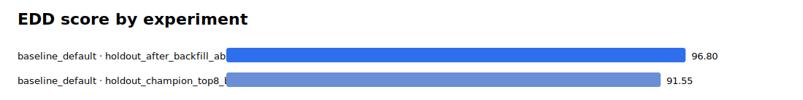
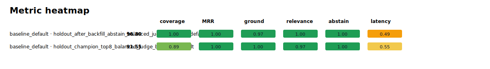
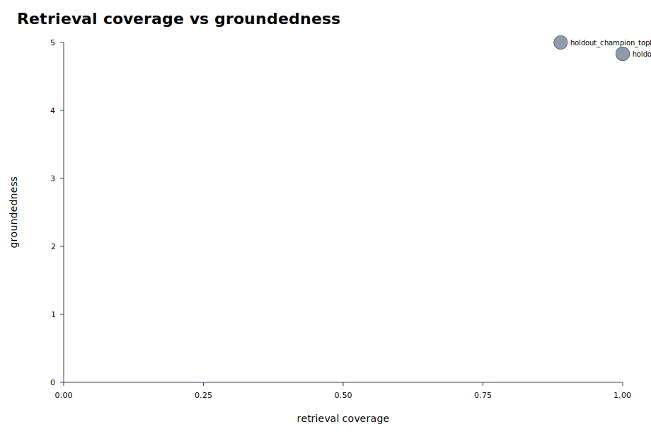
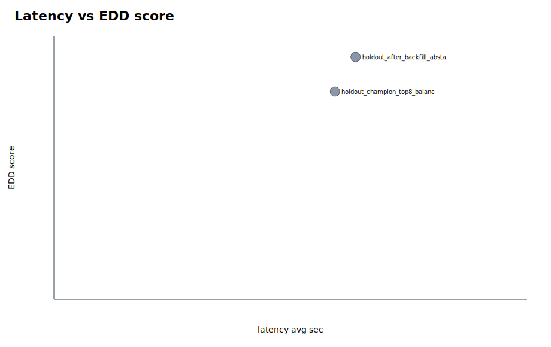

# Parallel Eval Summary

EDD score definition: 20% coverage, 10% hit-all-targets, 15% MRR, 20% groundedness, 20% relevance, 10% abstention accuracy, 5% latency score, minus penalties for false abstention and empty answers.

Rows missing groundedness/relevance are marked `diagnostic_only` and excluded from rankings and graphs because their EDD score is not comparable with fully judged runs.

- Scoreboard rows: 2
- Diagnostic-only rows: 2

## Best By Suite

| suite | run label | experiment | EDD | coverage | MRR | groundedness | relevance | false abstain | empty | latency |
|---|---|---|---:|---:|---:|---:|---:|---:|---:|---:|
| baseline_default | holdout_after_backfill_abstain_balanced_judge_baseline_default | baseline_default | 96.80 | 1.000 | 1.000 | 4.833 | 5.000 | 0.000 | 0.000 | 19.127 |

## Top Experiments

| rank | suite | run label | experiment | EDD | coverage | MRR | groundedness | relevance | false abstain | empty | latency |
|---:|---|---|---|---:|---:|---:|---:|---:|---:|---:|---:|
| 1 | baseline_default | holdout_after_backfill_abstain_balanced_judge_baseline_default | baseline_default | 96.80 | 1.000 | 1.000 | 4.833 | 5.000 | 0.000 | 0.000 | 19.127 |
| 2 | baseline_default | holdout_champion_top8_balanced_judge_baseline_default | baseline_default | 91.55 | 0.889 | 1.000 | 5.000 | 4.833 | 0.000 | 0.000 | 17.813 |

## Diagnostic-Only Rows

| suite | run label | experiment | EDD | coverage | MRR | abstention | latency | reason |
|---|---|---|---:|---:|---:|---:|---:|---|
| baseline_default | holdout_failure_probe_nojudge_backfill2_baseline_default | baseline_default | 56.89 | 1.000 | 1.000 | 1.000 | 21.677 | incomplete_no_judge |
| baseline_default | holdout_failure_probe_nojudge_rerun_baseline_default | baseline_default | 49.95 | 0.833 | 1.000 | 1.000 | 15.527 | incomplete_no_judge |

## Visuals

