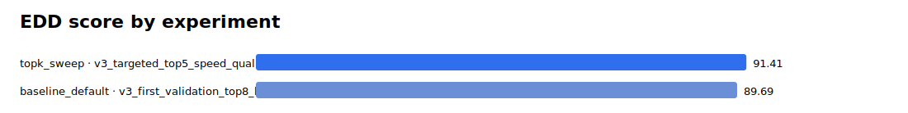
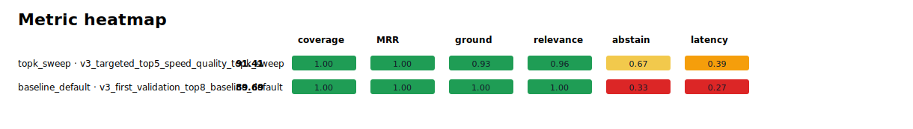
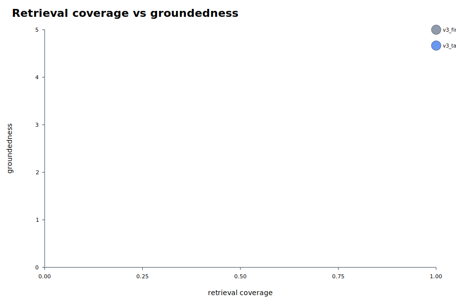
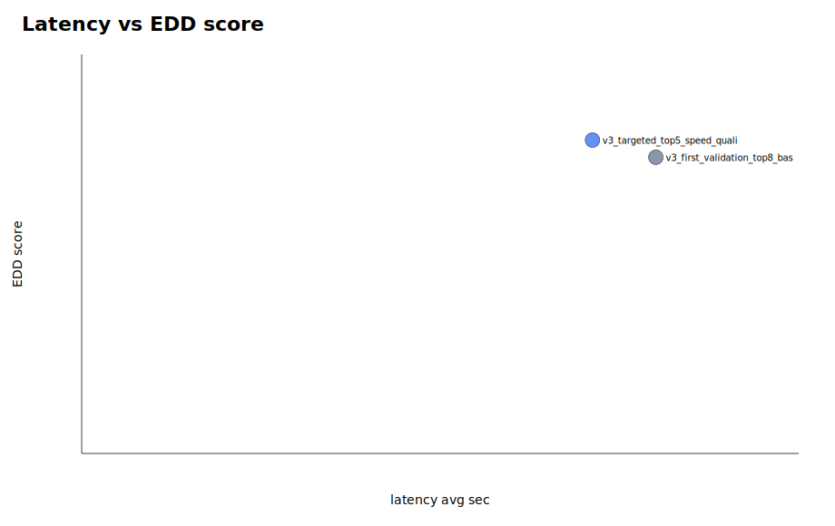

# Parallel Eval Summary

EDD score definition: 20% coverage, 10% hit-all-targets, 15% MRR, 20% groundedness, 20% relevance, 10% abstention accuracy, 5% latency score, minus penalties for false abstention and empty answers.

Rows missing groundedness/relevance are marked `diagnostic_only` and excluded from rankings and graphs because their EDD score is not comparable with fully judged runs.

- Scoreboard rows: 2
- Diagnostic-only rows: 0

## Best By Suite

| suite | run label | experiment | EDD | coverage | MRR | groundedness | relevance | false abstain | empty | latency |
|---|---|---|---:|---:|---:|---:|---:|---:|---:|---:|
| baseline_default | v3_first_validation_top8_baseline_default | baseline_default | 89.69 | 1.000 | 1.000 | 5.000 | 5.000 | 0.000 | 0.000 | 24.021 |
| topk_sweep | v3_targeted_top5_speed_quality_topk_sweep | topk5_filter_rewrite | 91.41 | 1.000 | 1.000 | 4.667 | 4.778 | 0.000 | 0.000 | 21.372 |

## Top Experiments

| rank | suite | run label | experiment | EDD | coverage | MRR | groundedness | relevance | false abstain | empty | latency |
|---:|---|---|---|---:|---:|---:|---:|---:|---:|---:|---:|
| 1 | topk_sweep | v3_targeted_top5_speed_quality_topk_sweep | topk5_filter_rewrite | 91.41 | 1.000 | 1.000 | 4.667 | 4.778 | 0.000 | 0.000 | 21.372 |
| 2 | baseline_default | v3_first_validation_top8_baseline_default | baseline_default | 89.69 | 1.000 | 1.000 | 5.000 | 5.000 | 0.000 | 0.000 | 24.021 |

## Visuals

