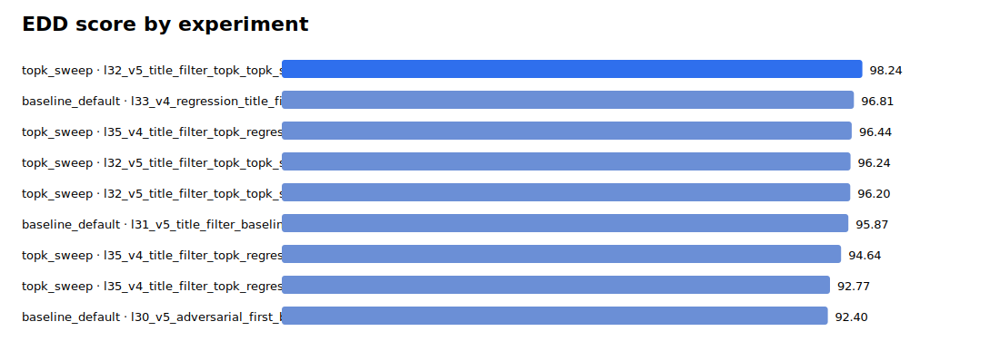
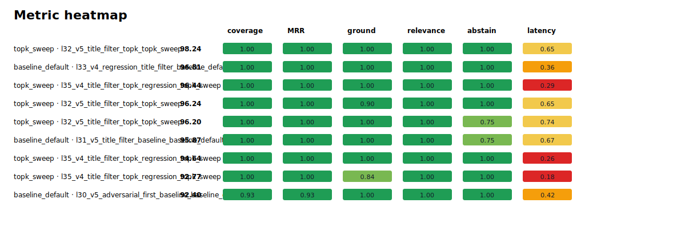
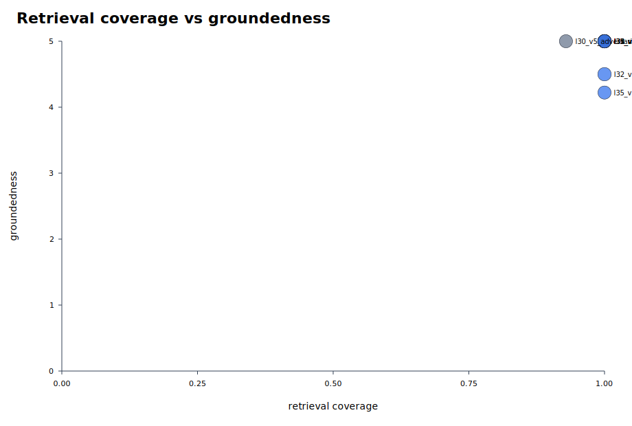
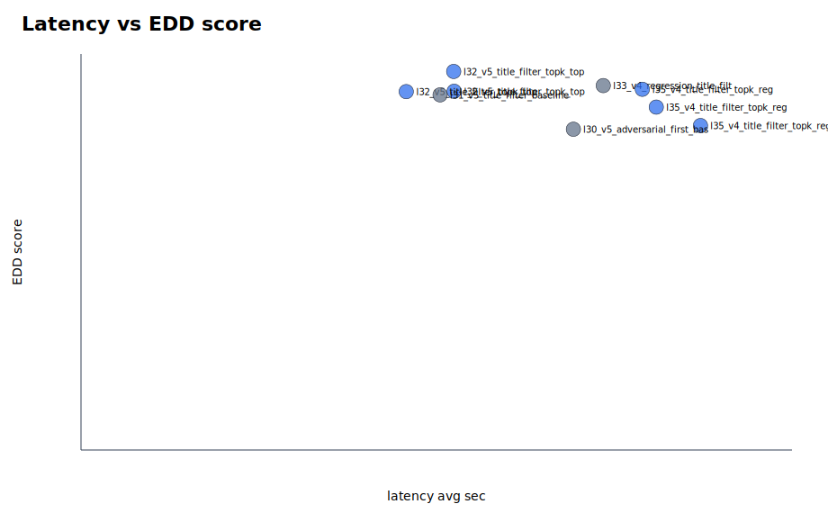

# Parallel Eval Summary

EDD score definition: 20% coverage, 10% hit-all-targets, 15% MRR, 20% groundedness, 20% relevance, 10% abstention accuracy, 5% latency score, minus penalties for false abstention and empty answers.

Rows missing groundedness/relevance are marked `diagnostic_only` and excluded from rankings and graphs because their EDD score is not comparable with fully judged runs.

- Scoreboard rows: 9
- Diagnostic-only rows: 0

## Best By Suite

| suite | run label | experiment | EDD | coverage | MRR | groundedness | relevance | false abstain | empty | latency |
|---|---|---|---:|---:|---:|---:|---:|---:|---:|---:|
| baseline_default | l33_v4_regression_title_filter_baseline_default | baseline_default | 96.81 | 1.000 | 1.000 | 5.000 | 5.000 | 0.000 | 0.000 | 22.035 |
| topk_sweep | l32_v5_title_filter_topk_topk_sweep | topk8_filter_rewrite_control | 98.24 | 1.000 | 1.000 | 5.000 | 5.000 | 0.000 | 0.000 | 15.726 |

## Top Experiments

| rank | suite | run label | experiment | EDD | coverage | MRR | groundedness | relevance | false abstain | empty | latency |
|---:|---|---|---|---:|---:|---:|---:|---:|---:|---:|---:|
| 1 | topk_sweep | l32_v5_title_filter_topk_topk_sweep | topk8_filter_rewrite_control | 98.24 | 1.000 | 1.000 | 5.000 | 5.000 | 0.000 | 0.000 | 15.726 |
| 2 | baseline_default | l33_v4_regression_title_filter_baseline_default | baseline_default | 96.81 | 1.000 | 1.000 | 5.000 | 5.000 | 0.000 | 0.000 | 22.035 |
| 3 | topk_sweep | l35_v4_title_filter_topk_regression_topk_sweep | topk5_filter_rewrite | 96.44 | 1.000 | 1.000 | 5.000 | 5.000 | 0.000 | 0.000 | 23.683 |
| 4 | topk_sweep | l32_v5_title_filter_topk_topk_sweep | topk12_filter_rewrite | 96.24 | 1.000 | 1.000 | 4.500 | 5.000 | 0.000 | 0.000 | 15.746 |
| 5 | topk_sweep | l32_v5_title_filter_topk_topk_sweep | topk5_filter_rewrite | 96.20 | 1.000 | 1.000 | 5.000 | 5.000 | 0.000 | 0.000 | 13.724 |
| 6 | baseline_default | l31_v5_title_filter_baseline_baseline_default | baseline_default | 95.87 | 1.000 | 1.000 | 5.000 | 5.000 | 0.000 | 0.000 | 15.151 |
| 7 | topk_sweep | l35_v4_title_filter_topk_regression_topk_sweep | topk8_filter_rewrite_control | 94.64 | 1.000 | 1.000 | 5.000 | 5.000 | 0.111 | 0.000 | 24.273 |
| 8 | topk_sweep | l35_v4_title_filter_topk_regression_topk_sweep | topk12_filter_rewrite | 92.77 | 1.000 | 1.000 | 4.222 | 5.000 | 0.000 | 0.000 | 26.137 |
| 9 | baseline_default | l30_v5_adversarial_first_baseline_baseline_default | baseline_default | 92.40 | 0.929 | 0.929 | 5.000 | 5.000 | 0.100 | 0.000 | 20.776 |

## Visuals

