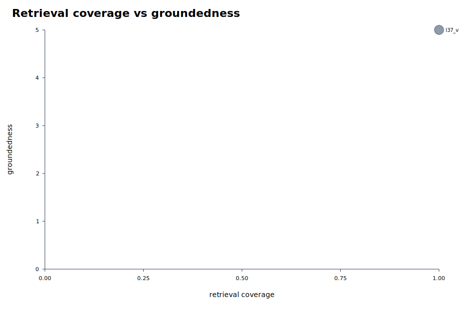
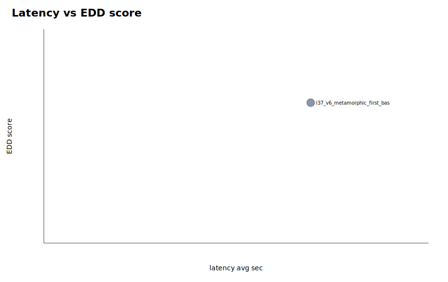

# Parallel Eval Summary

EDD score definition: 20% coverage, 10% hit-all-targets, 15% MRR, 20% groundedness, 20% relevance, 10% abstention accuracy, 5% latency score, minus penalties for false abstention and empty answers.

Rows missing groundedness/relevance are marked `diagnostic_only` and excluded from rankings and graphs because their EDD score is not comparable with fully judged runs.

- Scoreboard rows: 1
- Diagnostic-only rows: 48

## Best By Suite

| suite | run label | experiment | EDD | coverage | MRR | groundedness | relevance | false abstain | empty | latency |
|---|---|---|---:|---:|---:|---:|---:|---:|---:|---:|
| baseline_default | l37_v6_metamorphic_first_baseline_baseline_default | baseline_default | 86.25 | 1.000 | 0.944 | 5.000 | 5.000 | 0.000 | 0.000 | 20.809 |

## Top Experiments

| rank | suite | run label | experiment | EDD | coverage | MRR | groundedness | relevance | false abstain | empty | latency |
|---:|---|---|---|---:|---:|---:|---:|---:|---:|---:|---:|
| 1 | baseline_default | l37_v6_metamorphic_first_baseline_baseline_default | baseline_default | 86.25 | 1.000 | 0.944 | 5.000 | 5.000 | 0.000 | 0.000 | 20.809 |

## Diagnostic-Only Rows

| suite | run label | experiment | EDD | coverage | MRR | abstention | latency | reason |
|---|---|---|---:|---:|---:|---:|---:|---|
| baseline_default | l95_sensitive_preempt_v7_regression_baseline_default | baseline_default | 98.54 | 1.000 | 1.000 | 1.000 | 14.440 | diagnostic_question_set |
| topk_sweep | l79_v6_exposed_latency_topk_after_guards_topk_sweep | topk8_filter_rewrite_control | 98.15 | 1.000 | 1.000 | 1.000 | 16.130 | exposed_regression |
| topk_sweep | l79_v6_exposed_latency_topk_after_guards_topk_sweep | topk5_filter_rewrite | 98.13 | 1.000 | 1.000 | 1.000 | 16.209 | exposed_regression |
| topk8_only | l85_v7_source_exposed_topk8_latency_shard_topk8_only | topk8_filter_rewrite_control | 98.00 | 1.000 | 1.000 | 1.000 | 16.794 | diagnostic_question_set |
| topk5_only | l85_v7_source_exposed_topk5_latency_shard_topk5_only | topk5_filter_rewrite | 97.99 | 1.000 | 1.000 | 1.000 | 16.865 | diagnostic_question_set |
| baseline_default | l91_plain_language_hint_v7_regression_baseline_default | baseline_default | 97.82 | 1.000 | 1.000 | 1.000 | 17.613 | diagnostic_question_set |
| baseline_default | l60_v6_exposed_regression_backfill_guard_baseline_default | baseline_default | 97.59 | 1.000 | 1.000 | 1.000 | 18.612 | exposed_regression |
| baseline_default | l81_v7_source_exposed_prompt_diagnostic_baseline_default | baseline_default | 97.41 | 1.000 | 1.000 | 1.000 | 19.407 | diagnostic_question_set |
| baseline_default | l64_v6_exposed_regression_ambiguous_guard_baseline_default | baseline_default | 97.20 | 1.000 | 1.000 | 1.000 | 18.105 | exposed_regression |
| baseline_default | l76_v6_exposed_regression_final_guard_pass_baseline_default | baseline_default | 97.13 | 1.000 | 1.000 | 1.000 | 20.642 | exposed_regression |
| baseline_default | l73_v6_exposed_regression_project_and_answer_guards_baseline_default | baseline_default | 96.91 | 1.000 | 1.000 | 1.000 | 19.393 | exposed_regression |
| baseline_default | l68_v6_exposed_regression_project_focus_guard_baseline_default | baseline_default | 96.42 | 1.000 | 1.000 | 1.000 | 21.565 | exposed_regression |
| topk_sweep | l79_v6_exposed_latency_topk_after_guards_topk_sweep | topk12_filter_rewrite | 95.62 | 1.000 | 1.000 | 1.000 | 16.263 | exposed_regression |
| topk12_only | l85_v7_source_exposed_topk12_latency_shard_topk12_only | topk12_filter_rewrite | 95.51 | 1.000 | 1.000 | 1.000 | 19.922 | diagnostic_question_set |
| prompt_concise_verified_only | l77_v6_exposed_latency_prompt_concise_prompt_concise_verified_only | prompt_concise_verified | 92.25 | 1.000 | 1.000 | 0.500 | 20.112 | exposed_regression |
| baseline_default | l72_goyang_duplicate_cleanup_onecase_withjudge_baseline_default | baseline_default | 88.58 | 1.000 | 1.000 | 0.000 | 14.270 | diagnostic_question_set |
| baseline_default | l67_uicc_project_focus_onecase_withjudge_baseline_default | baseline_default | 88.25 | 1.000 | 1.000 | 0.000 | 15.710 | diagnostic_question_set |
| baseline_default | l89_plain_language_prompt_hint_probe_baseline_default | baseline_default | 88.02 | 1.000 | 1.000 | 0.000 | 16.700 | diagnostic_question_set |
| baseline_default | l56_backfill_guard_clean4_onecase_withjudge_baseline_default | baseline_default | 87.94 | 1.000 | 1.000 | 0.000 | 17.070 | diagnostic_question_set |
| baseline_default | l70_goyang_contradiction_cleanup_onecase_withjudge_baseline_default | baseline_default | 87.88 | 1.000 | 1.000 | 0.000 | 17.310 | diagnostic_question_set |
| prompt_sweep | l88_plain_language_format_probe_prompt_sweep | prompt_default | 87.55 | 1.000 | 1.000 | 0.000 | 18.800 | diagnostic_question_set |
| baseline_default | l44_cost_trace_onecase_withjudge_baseline_default | baseline_default | 87.44 | 1.000 | 1.000 | 0.000 | 19.270 | diagnostic_question_set |
| baseline_default | l59_backfill_guard_clean5_onecase_withjudge_baseline_default | baseline_default | 87.43 | 1.000 | 1.000 | 0.000 | 19.300 | diagnostic_question_set |
| baseline_default | l50_csv_summary_backfill_onecase_withjudge_baseline_default | baseline_default | 87.02 | 1.000 | 1.000 | 0.000 | 21.120 | diagnostic_question_set |
| baseline_default | l75_goyang_scope_denial_cleanup_onecase_withjudge_baseline_default | baseline_default | 86.59 | 1.000 | 1.000 | 0.000 | 22.990 | diagnostic_question_set |
| baseline_default | l40_v6_goyang_alias_retry_baseline_default | baseline_default | 85.00 | 1.000 | 1.000 | 0.000 | 40.690 | diagnostic_question_set |
| prompt_sweep | l88_plain_language_format_probe_prompt_sweep | prompt_strict_evidence | 85.00 | 1.000 | 1.000 | 0.000 | 58.210 | diagnostic_question_set |
| prompt_sweep | l88_plain_language_format_probe_prompt_sweep | prompt_concise_verified | 85.00 | 1.000 | 1.000 | 0.000 | 38.940 | diagnostic_question_set |
| prompt_sweep | l88_plain_language_format_probe_prompt_sweep | prompt_report_ready | 85.00 | 1.000 | 1.000 | 0.000 | 50.940 | diagnostic_question_set |
| topk_sweep | l39_v6_goyang_order_depth_probe_topk_sweep | topk8_filter_rewrite_control | 80.95 | 1.000 | 0.500 | 0.000 | 14.830 | diagnostic_question_set |
| topk_sweep | l39_v6_goyang_order_depth_probe_topk_sweep | topk5_filter_rewrite | 80.15 | 1.000 | 0.500 | 0.000 | 18.350 | diagnostic_question_set |
| topk_sweep | l39_v6_goyang_order_depth_probe_topk_sweep | topk12_filter_rewrite | 65.47 | 1.000 | 0.500 | 0.000 | 12.520 | diagnostic_question_set |
| baseline_default | l94_sensitive_preempt_latency_probe_baseline_default | baseline_default | 60.00 | 1.000 | 1.000 | 1.000 | 2.065 | diagnostic_question_set |
| baseline_default | l83_sensitive_guard_probe_nojudge_baseline_default | baseline_default | 57.16 | 1.000 | 1.000 | 1.000 | 20.510 | diagnostic_question_set |
| baseline_default | l38_v6_safety_prompt_retry_baseline_default | baseline_default | 56.04 | 1.000 | 1.000 | 1.000 | 25.440 | diagnostic_question_set |
| baseline_default | l55_backfill_guard_clean4_onecase_nojudge_baseline_default | baseline_default | 48.84 | 1.000 | 1.000 | 0.000 | 13.090 | diagnostic_question_set |
| baseline_default | l53_backfill_guard_clean2_onecase_nojudge_baseline_default | baseline_default | 48.17 | 1.000 | 1.000 | 0.000 | 16.060 | diagnostic_question_set |
| baseline_default | l58_backfill_guard_clean5_onecase_nojudge_baseline_default | baseline_default | 47.82 | 1.000 | 1.000 | 0.000 | 17.600 | diagnostic_question_set |
| baseline_default | l54_backfill_guard_clean3_onecase_nojudge_baseline_default | baseline_default | 47.79 | 1.000 | 1.000 | 0.000 | 17.710 | diagnostic_question_set |
| baseline_default | l48_evidence_guard_onecase_nojudge_baseline_default | baseline_default | 47.38 | 1.000 | 1.000 | 0.000 | 19.540 | diagnostic_question_set |
| baseline_default | l66_uicc_project_focus_onecase_nojudge_baseline_default | baseline_default | 47.21 | 1.000 | 1.000 | 0.000 | 20.290 | diagnostic_question_set |
| baseline_default | l43_cost_trace_onecase_nojudge_baseline_default | baseline_default | 46.94 | 1.000 | 1.000 | 0.000 | 21.460 | diagnostic_question_set |
| baseline_default | l52_backfill_guard_clean_onecase_nojudge_baseline_default | baseline_default | 46.92 | 1.000 | 1.000 | 0.000 | 21.530 | diagnostic_question_set |
| baseline_default | l49_csv_summary_backfill_onecase_nojudge_baseline_default | baseline_default | 46.68 | 1.000 | 1.000 | 0.000 | 22.610 | diagnostic_question_set |
| baseline_default | l62_ambiguous_abstention_concision_onecase_nojudge_baseline_default | baseline_default | 10.00 | 0.000 | 0.000 | 1.000 | 34.200 | diagnostic_question_set |
| baseline_default | l41_cost_trace_dryrun_baseline_default | baseline_default | 0.00 | 0.000 | 0.000 | 0.000 | 0.000 | diagnostic_dry_run |
| baseline_default | l42_cost_trace_dryrun_embedding_baseline_default | baseline_default | 0.00 | 0.000 | 0.000 | 0.000 | 0.000 | diagnostic_dry_run |
| baseline_default | l46_dryrun_not_skipped_baseline_default | baseline_default | 0.00 | 0.000 | 0.000 | 0.000 | 0.000 | diagnostic_dry_run |

## Visuals

