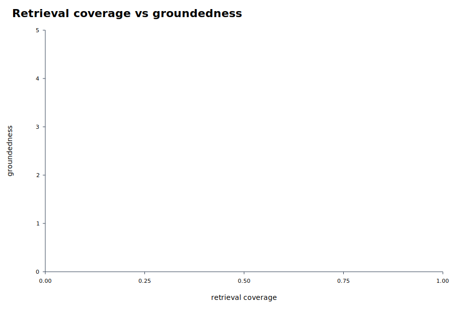

# Parallel Eval Summary

EDD score definition: 20% coverage, 10% hit-all-targets, 15% MRR, 20% groundedness, 20% relevance, 10% abstention accuracy, 5% latency score, minus penalties for false abstention and empty answers.

Rows missing groundedness/relevance are marked `diagnostic_only` and excluded from rankings and graphs because their EDD score is not comparable with fully judged runs.

- Scoreboard rows: 0
- Diagnostic-only rows: 2

## Best By Suite

| suite | run label | experiment | EDD | coverage | MRR | groundedness | relevance | false abstain | empty | latency |
|---|---|---|---:|---:|---:|---:|---:|---:|---:|---:|

## Top Experiments

| rank | suite | run label | experiment | EDD | coverage | MRR | groundedness | relevance | false abstain | empty | latency |
|---:|---|---|---|---:|---:|---:|---:|---:|---:|---:|---:|

## Diagnostic-Only Rows

| suite | run label | experiment | EDD | coverage | MRR | abstention | latency | reason |
|---|---|---|---:|---:|---:|---:|---:|---|
| topk5_only | l105_qv8_full_topk5_award_victim_guards_topk5_only | topk5_filter_rewrite | 99.13 | 1.000 | 1.000 | 1.000 | 11.813 | diagnostic_question_set |
| topk5_only | l104_a12_topk5_preempt_topk5_only | topk5_filter_rewrite | 60.00 | 1.000 | 1.000 | 1.000 | 2.120 | diagnostic_question_set |

## Visuals

