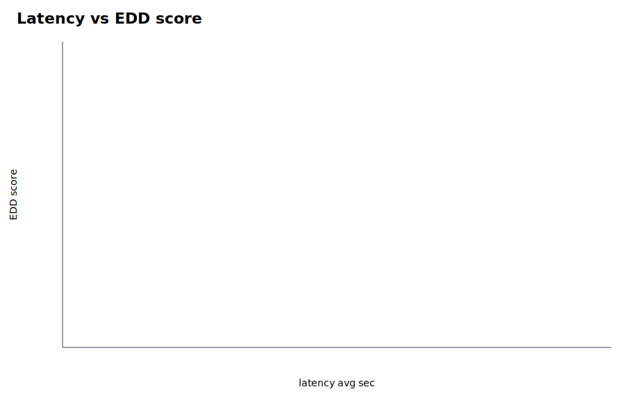

# Parallel Eval Summary

EDD score definition: 20% coverage, 10% hit-all-targets, 15% MRR, 20% groundedness, 20% relevance, 10% abstention accuracy, 5% latency score, minus penalties for false abstention and empty answers.

Rows missing groundedness/relevance are marked `diagnostic_only` and excluded from rankings and graphs because their EDD score is not comparable with fully judged runs.

- Scoreboard rows: 0
- Diagnostic-only rows: 8

## Best By Suite

| suite | run label | experiment | EDD | coverage | MRR | groundedness | relevance | false abstain | empty | latency |
|---|---|---|---:|---:|---:|---:|---:|---:|---:|---:|

## Top Experiments

| rank | suite | run label | experiment | EDD | coverage | MRR | groundedness | relevance | false abstain | empty | latency |
|---:|---|---|---|---:|---:|---:|---:|---:|---:|---:|---:|

## Diagnostic-Only Rows

| suite | run label | experiment | EDD | coverage | MRR | abstention | latency | reason |
|---|---|---|---:|---:|---:|---:|---:|---|
| prompt_sweep | prompt_sweep_prompt_sweep | prompt_concise_verified | 45.46 | 1.000 | 1.000 | 0.000 | 27.973 | diagnostic_unregistered_question_set |
| prompt_sweep | prompt_sweep_prompt_sweep | prompt_strict_evidence | 42.49 | 1.000 | 1.000 | 0.000 | 49.607 | diagnostic_unregistered_question_set |
| prompt_sweep | prompt_sweep_prompt_sweep | prompt_report_ready | 40.01 | 1.000 | 1.000 | 0.000 | 50.385 | diagnostic_unregistered_question_set |
| prompt_sweep | prompt_sweep_prompt_sweep | prompt_default | 37.50 | 1.000 | 1.000 | 0.000 | 30.782 | diagnostic_unregistered_question_set |
| topk_sweep | topk_sweep_topk_sweep | topk5_filter_rewrite | 33.85 | 1.000 | 1.000 | 0.000 | 24.065 | diagnostic_unregistered_question_set |
| topk_sweep | topk_sweep_topk_sweep | topk8_filter_rewrite_control | 32.51 | 1.000 | 1.000 | 0.000 | 34.197 | diagnostic_unregistered_question_set |
| baseline_default | baseline_default_baseline_default | baseline_default | 30.85 | 1.000 | 1.000 | 0.000 | 26.248 | diagnostic_unregistered_question_set |
| topk_sweep | topk_sweep_topk_sweep | topk12_filter_rewrite | 30.75 | 1.000 | 1.000 | 0.000 | 26.717 | diagnostic_unregistered_question_set |

## Visuals

